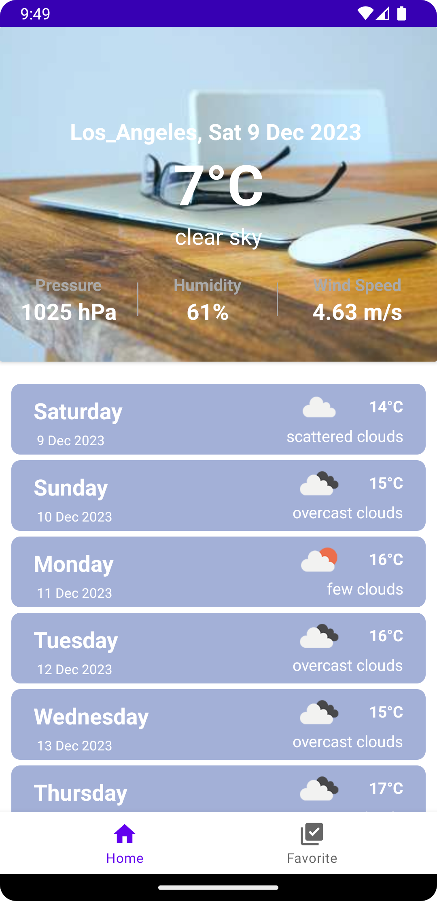
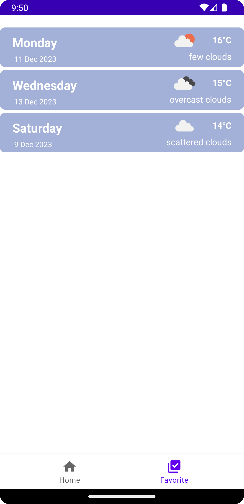

Introduction
============
Gleamy, weather on your hands.

**How To Run**
--------------

- Create file *config.properties* in your root project
- Initialize the secret key into your gradle file

ScreenShoot
-----------
